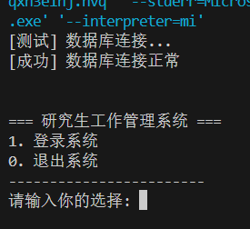

# grad-student-management-system
研究生信息管理系统

i.每个人员信息可以包含但不限于以下内容：学号、姓名、性别、入学时间、项目所属、工位标号、是否拥有实验室显示器等等（这里自由发挥）。
ii.该系统可以进行增、删、改、查、排序等功能，如根据学号删除或者工位查找。
任务一
完成此项目内容，您需要学习：C++基础语法与面向对象编程、C++文件操作等相关知识。
您可能会遇到:结构体指针或类对象指针、若干程序设计上的问题等相关问题。
1.基于面向对象的思想设计研究生工作管理系统(面向对象：个人信息类、实验室类等)。
2.考虑信息的安全性，系统应该布置有权限设计，所以此系统至少应该有两类账号，一个则是学生账号，仅包含只读、查询权限，而另一个则为管理员账号或者说教师账号，在学生账号的基础上还能拥有修改信息的权限，没有账号不能登录进入系统。
3.考虑到人员的数量不固定，系统具备增、删、改、查等功能。
i.增： 对于有增加权限的账号，能够增加人员信息，没有权限的不能，您可以考虑增加一条，或者一次增加多条随您发挥。
ii.删： 要求同上，对于有权限的账号，能够删除人员信息。
iii.改： 要求同上，对于有权限的账号，能够更新人员信息。
iv.查： 任何账号都能通过学号查询到人员信息，如果您愿意发挥，您也可以给不同的信息设置权限，封装账号权限来对应展示相关信息。
v.数据持久化：使用文件操作来进行离线保存。

任务二
完成此项目内容，在前面的基础上您需要学习：一种排序算法以您设计的数据管理的方式的实现、数据库表的设计、SQL语句，数据结构中链表实现与操作等。
您可能会遇到：数据库与后端的连接问题、SQL语句的书写
1.使用一种排序算法，对人员信息按编号进行排序。排序算法可以使用冒泡排序、选择排序等。（选择一种您喜欢的排序算法）
2.通过数据库（推荐mysql或sql server）进行数据存储和权限管理。
3.对于程序内部，考虑使用链表等数据结构来实现数据节点的管理，方便数据的增删改查（节点的设计，链表中的插入、删除、查询等功能的实现）。
其他
自由发挥，加入您想加入的任意功能（如：账户黑名单，白名单，管理系统日志记录等），学会git的使用方法，注册github账号，通过git提交到github账号仓库中。
工具
你可能用到的工具：Visual Studio（C++程序编写工具），Navicat（数据库可视化工具）,git（代码版本管理工具），。
技术指标
1.上述任务中所提到的功能都必须实现，只能多，不能少。
2.必须要有一定的人机交互能力，如cmd界面或者可视化界面等。
3.必须采用类思想。设计类之间的关系，设计程序中，可以参考一些优秀的设计模式，比如数据库采用单例模式来封装。
4.考虑一些输入不规范的情况，比如限定输入数字时，输入了字符，如何处理？
汇报要求
1.展现实现的功能时，给出相应的逻辑框图，可以在ProcessOn中快速构建。
2.需要简述自己的代码架构，讲解代码源码。
3.PPT汇报。
提示
1.系统的实现过程中，应该考虑操作的容错。如：
1). 增加人员信息时，只增加人员的部分信息。 
2). 人员的信息格式检查。
2.在实现的过程中，尽量考虑到可拓展性，如果您只完成基础版本，至少有拓展进阶版的代码设计基础。
学习指南
SQL：https://blog.csdn.net/Janson_Lin/article/details/116530497?ops_request_misc=%257B%2522request%255Fid%2522%253A%2522168501853716800182144097%2522%252C%2522scm%2522%253A%252220140713.130102334..%2522%257D&request_id=168501853716800182144097&biz_id=0&utm_medium=distribute.pc_search_result.none-task-blog-2~all~top_positive~default-1-116530497-null-null.142^v88^control_2,239^v2^insert_chatgpt&utm_term=sql%E8%AF%AD%E6%B3%95&spm=1018.2226.3001.4187

